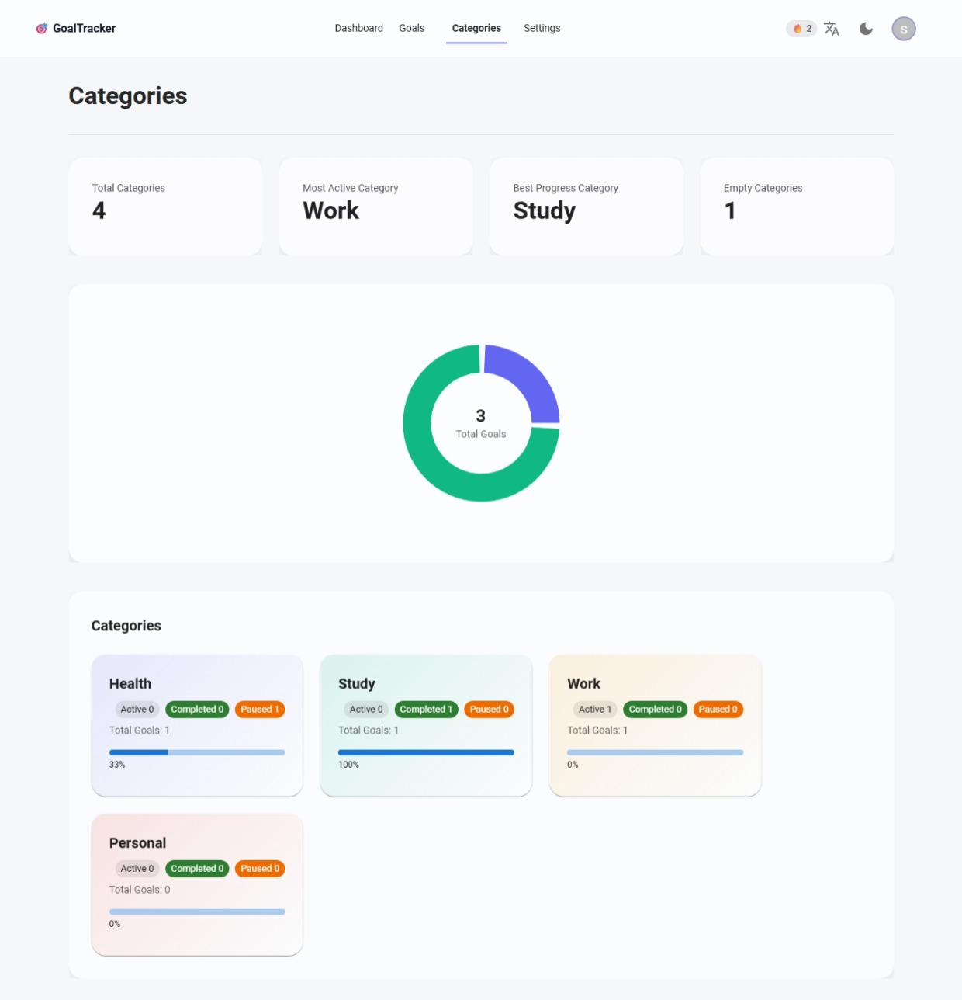

# 🎯 Goal Tracker 

A modern and responsive goal tracking web application built with React and Material UI.  
It helps users create goals, track progress, and stay motivated using gamification features like XP, streaks.

---

##  Live Demo

**Live Project:** [view Website](https://goal-tracker-awgc.vercel.app/)

---

##  Project Preview

### Dashboard
.png)

### Goals Page
.png)

### Categories

### Settings
.png)

---

##  Features

###  Goal Management (CRUD)
- Create, edit, and delete goals
- Pause and resume goals
- Automatic completion when target is reached

###  Progress Tracking
- Progress bars for each goal
- Daily progress logging
- Automatic percentage calculation

###  Gamification
- XP system (+20 per progress)
- Level system (every 100 XP = new level)
- Daily streak tracking

###  Dashboard
- Overall completion percentage
- Active goals overview
- Completed goals preview

###  Categories
- Health, Study, Work, Personal
- Category-based filtering
- Category progress analytics (chart)

###  Multi-language Support
- English 🇬🇧 / Persian 🇮🇷
- RTL / LTR layout switching

###  UI/UX
- Responsive design (mobile + desktop)
- Material UI components
- Clean modern interface

---

## Data Model
- Goal
- id
- title
- category
- type (daily | count | time)
- target
- progress
- status (active | paused | completed)
- startDate, endDate
- logs [{ date, amount }]
- createdAt, updatedAt
### UserStats
- xpTotal
- streak
- completedCount
## Streak Logic
- Streak increases when user logs progress daily
- Only one streak increment per day
- Missing a day may reset streak (basic logic)
## XP System
- Each progress log gives +20 XP
- XP is accumulated in user stats
- Level = XP / 100
## Pages (Routing)
- /dashboard → Main dashboard
- /goals → All goals list
- /goals/new → Create goal
- /goals/:id → Goal details
- /categories → Category overview
- /settings → App settings
- /login → Authentication
- /register → Registration
- * → 404 page
## Tech Stack
- React (Vite)
- Material UI (MUI)
- React Router
- i18next (Internationalization)
- LocalStorage (Data persistence)
- Recharts (Charts)

##  Project Structure

 src/ ├── components/ ├── pages/ ├── layout/ ├── context/ ├── router/ ├── i18n/ ├── theme/ └── App.jsx
---

##  Installation
  cd goal-tracker
  npm install npm run dev
---

